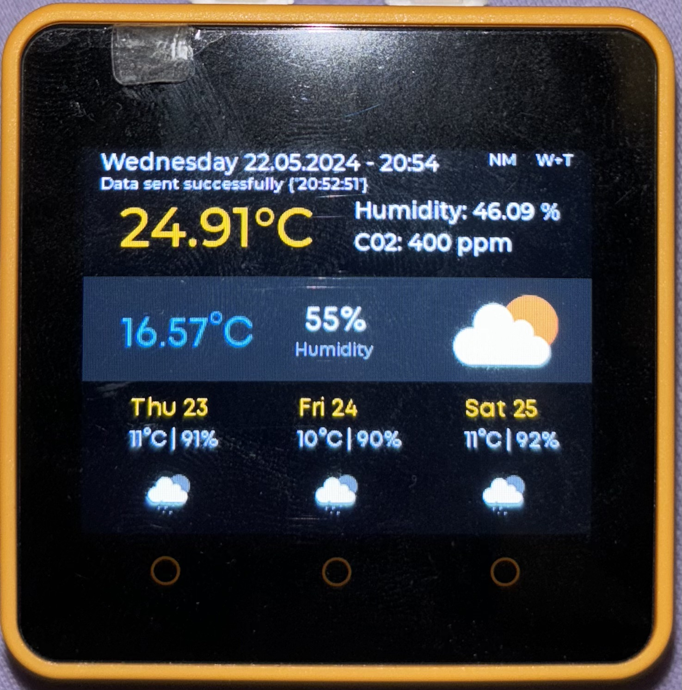

# Indoor & Outdoor Weather Monitoring System

## 🌐 Project Overview
This project implements an indoor/outdoor weather monitoring system using an M5Stack IoT device integrated with various sensors. The system gathers data from indoor conditions and outdoor weather information via an API, presenting it through a cloud-based dashboard developed with Plotly Dash and on the M5Stack device screen. The M5Stack device also has the ability to say out loud weather conditions when specific criteria are met. 

## 📁 Project Structure
- `m5stack`: Contains scripts for the M5Stack device interface.
  - `dashboard_ui.py`
  - `data_collector.py`
- `online_dashboard`: Houses the Plotly Dash web application.
  - `Dockerfile`
  - `app.py`: Main application file
  - `assets/`: CSS style files for the dashboard
  - `dashboard_callbacks.py`: Callback functions for the dashboard
  - `dashboard_elements.py`: Defines the layout and elements of the dashboard
  - `dashboard_service.py`: Handles data fetching for the dashboard
  - `requirements.txt`: Dependencies for the web application
  - `utils.py`: Utility functions
- `service`: Backend services for handling data and API interactions.
  - `Dockerfile`
  - `app.py`: Flask app entry point to manage middleware/services
  - `bigquery_client.py`: Manages BigQuery operations for data storage and retrieval.
  - `texttospeech_client.py`: Integrates text-to-speech functionality using Google APIs.
  - `vertexai_client.py`: Handles interactions with Vertex AI LLM allowing to generate realistic weather descriptions.
  - `weather_client.py`: Fetches outdoor weather data from external APIs.
  - `unit_tests/`: Tests for service reliability
- `res`: Non code related assets for the whole project

## 🤖 M5Stack IoT Device

The M5Stack IoT device serves as a compact yet powerful sensor hub designed to collect environmental data both indoors and outdoors. It features a versatile interface that allows for real-time monitoring and interaction.

### 🌡️ Functionalities:
- **Environmental Sensing**: Measures indoor temperature and humidity using an environmental sensor (ENV3).
- **Air Quality Monitoring**: Monitors indoor air quality with a Total Volatile Organic Compounds (TVOC) gas detector, providing CO2 level readings.
- **Time and Date Management**: Synchronizes with an NTP server to maintain accurate time and date display, adapting to the local timezone.
- **Motion Detection**: Utilizes a Passive Infrared (PIR) motion sensor to detect presence and activity within the monitored area.
- **Weather Forecasting**: Displays real-time outdoor weather conditions and forecasts by integrating with weather APIs.
- **Historical Data Visualization**: Displays graphical representations of the last 7 days of historical data, including CO2 levels, indoor humidity, and temperature, fetched from BigQuery.
- **Connectivity**: Supports automatic Wi-Fi connections for reliable data transmission to cloud services and remote monitoring capabilities.
- **Alerts and Notifications**: Sends alerts for significant changes in environmental conditions, such as high humidity or poor air quality, and triggers visual alerts using light signals.
- **Voice Announcements**: Generates and plays spoken weather updates based on current weather data.
- **Data Transmission**: Sends real-time sensor data to a server for further processing and storage in BigQuery.
- **Offline Data Buffering**: Stores sensor data locally when offline and sends it to the server once the connection is reestablished.

### ℹ️ Display Information:

The M5Stack screen provides real-time visual feedback of various environmental parameters and system statuses. Below is a detailed breakdown of the information displayed:

- **Date and Time**: The current date and time are displayed at the top of the screen.
- **Wi-Fi Status**: Indicates the status of the Wi-Fi connection:
  - `W+T`: Both Wi-Fi and time synchronization are successful.
  - `W-T`: Only Wi-Fi is connected.
  - `-W`: Wi-Fi is disconnected.
- **Motion Status**: Shows `M` when motion is detected and `NM` when no motion is detected.
- **Temperature**: Displays the current indoor temperature measured by the environmental sensor.
- **Humidity**: Displays the current indoor humidity level. If the humidity is greater than 60% or less than 40%, the text is displayed in red, and an LED alert is triggered.
- **Air Quality**: Shows the CO2 concentration in parts per million (ppm) as measured by the TVOC gas detector. If the CO2 level exceeds 1000 ppm, the text is displayed in red, and an LED alert is triggered.
- **Weather Information**: Displays images for current and future weather forecasts, fetched from a weather API and updated periodically.
- **Historical Data Visualization**: By pressing the B button (middle button on the M5Stack), an image displays graphical representations of the last 7 days of data, including CO2 levels, indoor humidity, and temperature. Press the B button again to return to the normal display.
- **Error Messages and Status Updates**: Shows any errors or important status updates to inform the user of the system's current state.
- **Pending Data Indicator**: Indicates the number of data points stored locally, which will be sent once the Wi-Fi connection is reestablished. This indicator is visible only when the Wi-Fi connection is lost.


### 🖼️ Dashboard Preview
Below is a photo of the M5Stack device's dashboard, showcasing its capabilities in real-time data display.




### M5Stack Requirements

1. Required Hardware: M5Stack Core2, ENV3 Environmental Sensor, PIR Motion Sensor, TVOC Gas Detector.
2. Ensure you have Python 3.x installed on the M5Stack device.

### M5Stack Setup

1. Clone the project repository to the device (only the `dashboard_ui.py` file is needed).
2. Load the required images into the `res` folder on the M5Stack device. The images can be found in the `res` folder of the project repository:
   - `default_current_weather.png`
   - `default_future_weather.png`
   - `fetch-bigquery-history-image.png`
3. Configure the Wi-Fi credentials in the `dashboard_ui.py` script.
4. Run the `dashboard_ui.py` script to start the device interface.


## ⚙️ Backend Service

The backend service is the core of data management and interaction in our project, built using Flask. This service acts as a middleware to handle data storage, retrieval, and real-time data processing between the M5Stack IoT device and the cloud.

### 📈 Functionalities:
- **Data Handling**: Manages the storage and retrieval of sensor data and weather information in Google's BigQuery.
- **Weather Data Integration**: Integrates with OpenWeatherMap API to fetch real-time and forecasted weather data based on user location derived from IP addresses.
- **Image Generation**: Creates visual representations of current and forecasted weather conditions.
- **Text-to-Speech**: Converts weather descriptions into spoken output, enhancing accessibility and user interaction.
- **API Endpoints**:
  - `/send-to-bigquery`: Receives and stores data into BigQuery.
  - `/current-weather`: Fetches and returns current weather data.
  - `/future-weather`: Provides future weather forecasts.
  - `/generate-weather-image`: Generates an image depicting the current weather, including temperature, humidity, and weather icons.
  - `/generate-future-weather-image`: Creates images showing future weather forecasts.
  - `/generate-current-weather-spoken`: Generates spoken weather descriptions from current weather data.
  - `/fetch-bigquery-history`: Retrieves historical weather data stored in BigQuery.
  - `/fetch-bigquery-history-image`: Visualizes historical weather data through dynamically generated graphs.

### 🌍 API Interaction
The backend extensively interacts with external APIs and internal data to provide comprehensive weather analytics and real-time updates. 

### 🌐 Service Deployment on Google Cloud Run
To deploy the backend service on Google Cloud Run:

1. Clone the project repository using Google Cloud Console Cloud Shell.
2. Navigate to the `service` directory.
3. Build the Docker image for the service:
    ```
    docker build -t eu.gcr.io/<your-project-id>/weather_service:latest .
    gcloud auth configure-docker
    docker push eu.gcr.io/<your-project-id>/weather_service:latest
    ```
4. Deploy the service on Cloud Run by creating a new deployment.
5. Configure the following environment variables and API keys:
- `OPENWEATHERMAP_API_KEY`: The API key for accessing the OpenWeatherMap services, which provide weather data such as temperature, humidity, and forecasts.

- `IPINFO_API_KEY`: The API key for IPinfo, a service that offers geolocation data for IP addresses, helping determine the geographic location of the M5Stack IoT Device.

- `PROJECT_ID`: The unique identifier for your Google Cloud Project where all cloud resources are stored and managed.

- `PROJECT_LOCATION`: The geographical region or location of the Google Cloud project. 

- `DATASET_NAME`: The name of the BigQuery dataset within your Google Cloud Project where all weather data is stored.

- `WEATHER_TABLE`: The name of the table within the BigQuery dataset that specifically holds weather-related data from M5Stack sensors and the weather API. 


## 🖥️ Online Dashboard

The online dashboard, developed using **Plotly Dash** and **dash_bootstrap_components**, provides a comprehensive and interactive visualization of weather data collected both indoors and outdoors. It is designed to display current conditions, historical data, and averages in a clear and informative layout.

### 🌤️ Functionalities:
- **Current Weather Display**: Shows real-time weather conditions, including air quality, visibility, and wind speed.
- **Temperature and Humidity Monitoring**: Displays current indoor and outdoor temperature and humidity levels with dynamic gauges and thermometers.
- **Average Weather Plots**: Visualizes daily average temperature and humidity with interactive graphs.
- **Historical Data Exploration**: Allows users to select dates and graph types to review past weather conditions.

### 🌐 Access the Dashboard
The dashboard can be accessed online [here](https://final-project-dashboard-c7loi7tmea-oa.a.run.app).

### 🖼️ Dashboard Screenshot
Below is a screenshot of the online dashboard, illustrating the layout and design of the user interface.


### 🖥️ Dashboard Deployment on Google Cloud Run
To deploy the dashboard on Google Cloud Run:

1. Ensure the service is already up and running.
2. Clone the project repository and navigate to the `online_dashboard` directory in GCP Console Cloud Shell.
3. Build the Docker image for the dashboard:
    ```
    docker build -t eu.gcr.io/<your-project-id>/final_project_dashboard:latest .
    gcloud auth configure-docker
    docker push eu.gcr.io/<your-project-id>/final_project_dashboard:latest
    ```
4. Deploy the dashboard on Cloud Run by creating a new deployment.
5. Set the `SERVICE_CLOUD_RUN_URL` environment variable to the URL of the deployed service.


## 👥 Contributors

### Philippe Megbemado (phe3l)
**Contributions**:
- Designed, developed, and deployed the M5Stack device UI and functionalities.
- Initiated the development of the web service with BigQuery functions and the weather API. Developed the backend functions that generate the visual graphs for displaying on the M5Stack device. 
- Created the Google Cloud Platform project and configured the BigQuery database.

### Mykhailo Zotov (wildchilling)
**Contributions**:
- Developed and deployed the web dashboard using Plotly Dash to Google Cloud Platform.
- Took over the development of the web service, integrating additional functionalities such as Text-to-Speech and Language Learning Models (LLMs).
- Designed the overall architecture of the project, decoupled various parts of the codebase to enhance modularity and maintainability, created this readme.

## 🍿 Video on the Project
The Video explaining the project can be accessed by following [this link](#). 


