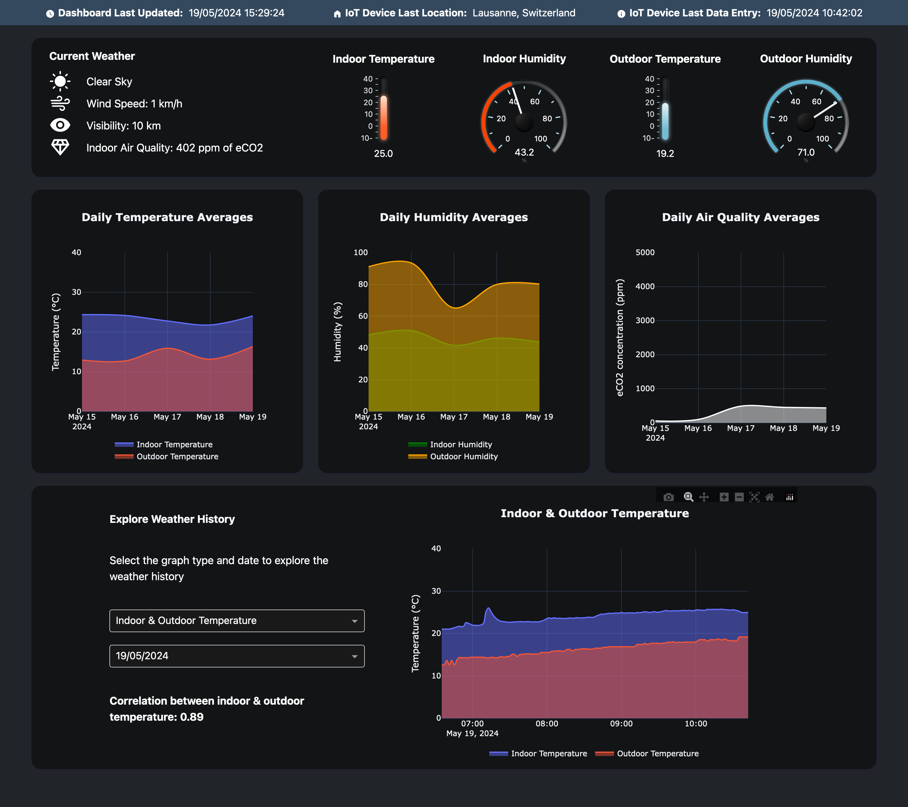

# Project Cloud - Indoor/Outdoor Weather Monitoring System

## 🌐 Project Overview
This project implements an indoor/outdoor weather monitoring system using an M5Stack IoT device integrated with various sensors. The system gathers data from indoor conditions and outdoor weather information via an API, presenting it through a cloud-based dashboard developed with Plotly Dash and on the M5Stack device screen. The M5Stack device also has the ability to say out loud waether conditions when specific criteria are met. 

## 📁 Project Structure
- `m5stack`: Contains scripts for the M5Stack device interface.
  - `dashboard_ui.py`
  - `data_collector.py`
  - `ui_with_page.py`
- `online_dashboard`: Houses the Plotly Dash web application.
  - `Dockerfile`
  - `app.py`: Main application file
  - `assets/`: CSS style files for the dashboard
  - `dashboard_callbacks.py`: Callback functions for the dashboard
  - `dashboard_elements.py`: Defines the layout and elements of the dashboard
  - `dashboard_service.py`: Handles data fetching for the dashboard
  - `requirements.txt`: Dependencies for the web application
  - `utils.py`: Utility functions
- `service`: Backend services for handling data and API interactions.
  - `Dockerfile`
  - `app.py`: Flask app entry point to manage middleware/services
  - `bigquery_client.py`: Manages BigQuery operations for data storage and retrieval.
  - `texttospeech_client.py`: Integrates text-to-speech functionality using Google APIs.
  - `vertexai_client.py`: Handles interactions with Vertex AI for advanced analytics.
  - `weather_client.py`: Fetches outdoor weather data from external APIs.
  - `unit_tests/`: Tests for service reliability

## 🤖 M5Stack IoT Device

The M5Stack IoT device serves as a compact yet powerful sensor hub designed to collect environmental data both indoors and outdoors. It features a versatile interface that allows for real-time monitoring and interaction.

### 🌡️ Functionalities:
- **Environmental Sensing**: Measures indoor temperature and humidity through an environmental sensor.
- **Motion Detection**: Utilizes a PIR motion sensor to detect presence and activity.
- **Air Quality Monitoring**: Incorporates a TVOC gas detector to monitor indoor air quality.
- **Time and Date**: Maintains accurate time via NTP synchronization, displaying current date and time.
- **Weather Forecast**: Shows real-time outdoor weather conditions and forecasts using collected data and API integration.
- **Connectivity**: Supports Wi-Fi connections for data transmission to cloud services and remote monitoring.
- **Alerts and Notifications**: Provides alerts for significant changes in environmental conditions, such as air quality or humidity levels.

### 🖼️ Dashboard Preview
Below is a screenshot of the M5Stack device's dashboard, showcasing its capabilities in real-time data display:


### 🛠 M5Stack Deployment
To deploy the M5Stack device interface:

1. Ensure you have Python 3.x installed on the M5Stack device.
2. Clone the project repository to the device.
4. Run the `dashboard_ui.py` script to start the device interface.

## ⚙️ Backend Service

The backend service is the core of data management and interaction in our project, built using Flask. This service acts as a middleware to handle data storage, retrieval, and real-time data processing between the M5Stack IoT device and the cloud.

### 📈 Functionalities:
- **Data Handling**: Manages the storage and retrieval of sensor data and weather information in Google's BigQuery.
- **Weather Data Integration**: Integrates with OpenWeatherMap API to fetch real-time and forecasted weather data based on user location derived from IP addresses.
- **Image Generation**: Creates visual representations of current and forecasted weather conditions.
- **Text-to-Speech**: Converts weather descriptions into spoken output, enhancing accessibility and user interaction.
- **API Endpoints**:
  - `/send-to-bigquery`: Receives and stores data into BigQuery.
  - `/current-weather`: Fetches and returns current weather data.
  - `/future-weather`: Provides future weather forecasts.
  - `/generate-weather-image`: Generates an image depicting the current weather, including temperature, humidity, and weather icons.
  - `/generate-future-weather-image`: Creates images showing future weather forecasts.
  - `/generate-current-weather-spoken`: Generates spoken weather descriptions from current weather data.
  - `/fetch-bigquery-history`: Retrieves historical weather data stored in BigQuery.
  - `/fetch-bigquery-history-image`: Visualizes historical weather data through dynamically generated graphs.

### 🌍 API Interaction
The backend extensively interacts with external APIs and internal data to provide comprehensive weather analytics and real-time updates. It also supports image and voice output to enhance user experience by presenting data in multiple formats.

### 🌐 Service Deployment on Google Cloud Run
To deploy the backend service on Google Cloud Run:

1. Clone the project repository to your local machine.
2. Navigate to the `service` directory.
3. Build the Docker image for the service:
    ```
    docker build -t eu.gcr.io/<your-project-id>/weather_service:latest .
    gcloud auth configure-docker
    docker push eu.gcr.io/<your-project-id>/weather_service:latest
    ```
4. Deploy the service on Cloud Run by creating a new deployment.
5. Configure the following environment variables and API keys:
- `OPENWEATHERMAP_API_KEY`: The API key for accessing the OpenWeatherMap services, which provide weather data such as temperature, humidity, and forecasts.

- `IPINFO_API_KEY`: The API key for IPinfo, a service that offers geolocation data for IP addresses, helping determine the geographic location of the M5Stack IoT Device.

- `PROJECT_ID`: The unique identifier for your Google Cloud Project where all cloud resources are stored and managed.

- `PROJECT_LOCATION`: The geographical region or location in Google Cloud where your project's resources, like BigQuery datasets, are hosted for regulatory or latency considerations.

- `DATASET_NAME`: The name of the BigQuery dataset within your Google Cloud Project where all weather data is stored.

- `WEATHER_TABLE`: The name of the table within the BigQuery dataset that specifically holds weather-related data such as temperatures and humidity levels.


## 🖥️ Online Dashboard

The online dashboard, developed using Plotly Dash and dash_bootstrap_components, provides a comprehensive and interactive visualization of weather data collected both indoors and outdoors. It is designed to display current conditions, historical data, and averages in a clear and informative layout.

### 🌤️ Functionalities:
- **Current Weather Display**: Shows real-time weather conditions, including air quality, visibility, and wind speed.
- **Temperature and Humidity Monitoring**: Displays current indoor and outdoor temperature and humidity levels with dynamic gauges and thermometers.
- **Average Weather Plots**: Visualizes daily average temperature and humidity with interactive graphs.
- **Historical Data Exploration**: Allows users to select dates and graph types to review past weather conditions.
- **Responsive Design**: Ensures the dashboard is accessible and functional on various devices and screen sizes.

### 🌐 Access the Dashboard
The dashboard can be accessed online [here](https://final-project-dashboard-c7loi7tmea-oa.a.run.app).

### 🖼️ Dashboard Screenshot
Below is a screenshot of the online dashboard, illustrating the layout and design of the user interface:



### 🖥️ Dashboard Deployment on Google Cloud Run
To deploy the dashboard on Google Cloud Run:

1. Ensure the service is already up and running.
2. Navigate to the `online_dashboard` directory.
3. Build the Docker image for the dashboard:
    ```
    docker build -t eu.gcr.io/<your-project-id>/final_project_dashboard:latest .
    gcloud auth configure-docker
    docker push eu.gcr.io/<your-project-id>/final_project_dashboard:latest
    ```
4. Deploy the dashboard on Cloud Run by creating a new deployment.
5. Set the `SERVICE_CLOUD_RUN_URL` environment variable to the URL of the deployed service.


## 👥 Contributors

### Philippe Megbemado (phe3l)
**Contributions**:
- Designed, developed, and deployed the M5Stack device UI and dashboard.
- Initiated the development of the web service with BigQuery functions and the weather API. Developed the backend functions that generate the visual graphs for displaying on the M5Stack device. 
- Created the Google Cloud Platform project and configured the BigQuery database.

### Mykhailo Zotov (wildchilling)
**Contributions**:
- Developed and deployed the web dashboard using Plotly Dash to Google Cloud Platform.
- Designed the overall architecture of the project, decoupled various parts of the codebase to enhance modularity and maintainability and designed this readme.
- Took over the development of the web service from Philippe, integrating additional functionalities such as Text-to-Speech and Language Learning Models (LLMs).


